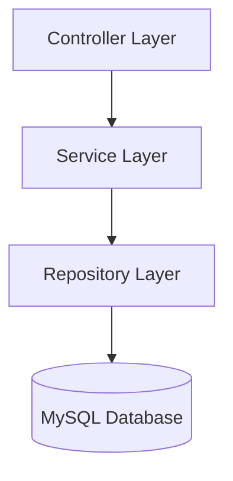
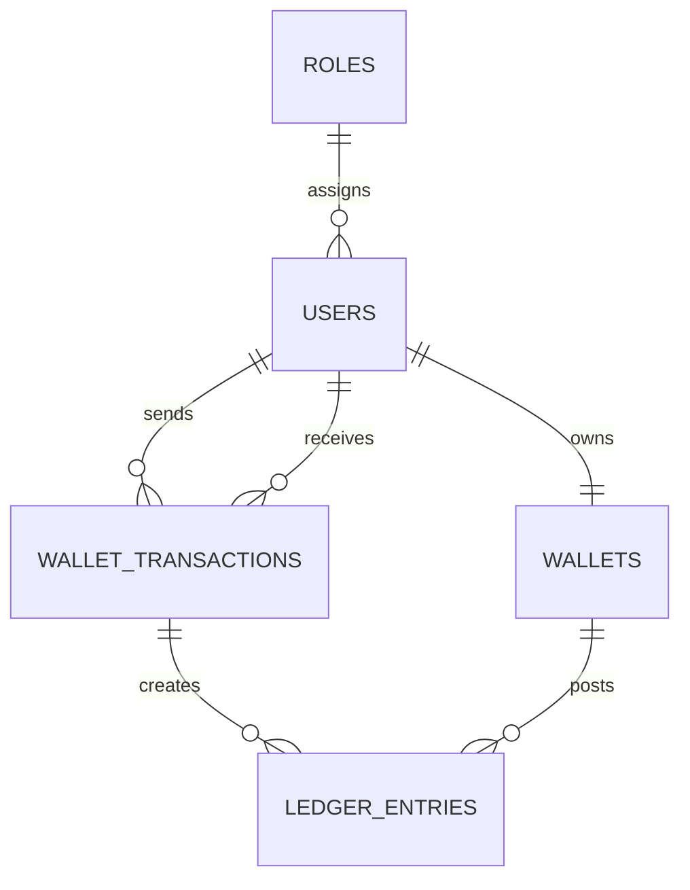

# Digital Wallet & Transaction Management System

Production-grade Spring Boot fintech wallet platform built with Java 21, Spring Boot, MySQL, JWT authentication, JPA/Hibernate, and Docker.

## Features

- User registration and login
- JWT authentication with Spring Security
- Role-based access control for USER and ADMIN
- BCrypt password hashing
- Automatic wallet creation on registration
- Add money, withdraw money, and transfer money with ACID transactions
- Double-entry ledger for transfer flows
- Full transaction history with status tracking
- Admin APIs for users, wallets, transactions, and balance monitoring
- Global exception handling and validation

## Architecture



## Database Model



## API Overview

- `POST /api/auth/register`
- `POST /api/auth/login`
- `GET /api/wallet/balance`
- `POST /api/wallet/add-money`
- `POST /api/wallet/withdraw`
- `POST /api/wallet/transfer`
- `GET /api/wallet/transactions`
- `GET /api/admin/users`
- `GET /api/admin/wallets`
- `GET /api/admin/transactions`
- `GET /api/admin/transactions/{transactionId}`
- `GET /api/admin/balances/summary`

## Setup

```bash
mvn clean spring-boot:run
```

```bash
docker compose up --build
```

## How to run

1. Make sure MySQL is running and matches `src/main/resources/application.properties`:
   - URL: `jdbc:mysql://localhost:3306/walletdb?createDatabaseIfNotExist=true&useSSL=false&allowPublicKeyRetrieval=true&serverTimezone=UTC`
   - Username: `wallet`
   - Password: `walletpass`

2. Build and run with Maven:

```powershell
mvn clean package
java -jar target/wallet-system-1.0.0.jar
```

If `mvn` is not available on PATH, use your local Maven executable:

```powershell
& "C:\Users\HP\Downloads\apache-maven-3.9.15-bin (1)\apache-maven-3.9.15\bin\mvn.cmd" clean package
java -jar target\wallet-system-1.0.0.jar
```

3. Or run directly with Spring Boot:

```powershell
mvn clean spring-boot:run
```

4. Or with Docker Compose:

```powershell
docker compose up --build
```

## Verify the running project

If the app is running, use:

```powershell
python verify_project.py
```

This will automatically test auth, wallet, and admin endpoints.

## Default Admin

The app seeds an admin account on startup using environment variables:

- `APP_ADMIN_EMAIL`
- `APP_ADMIN_PASSWORD`

If not provided, the defaults are `admin@wallet.com` / `Admin@12345`.

## Security Notes

- JWT is stateless and signed with `JWT_SECRET`.
- Money movement is wrapped in database transactions.
- Wallet rows are locked during balance updates to prevent race conditions.
